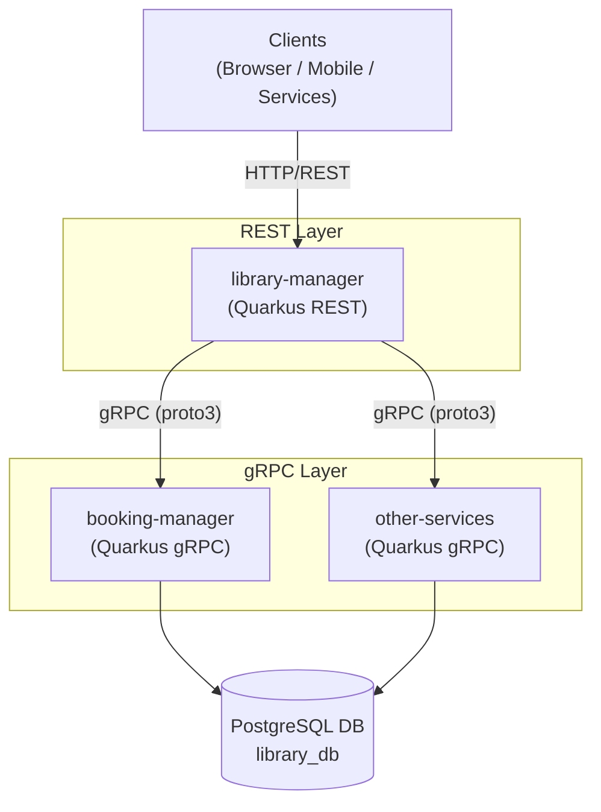

# Library Manager Project

A library management system built with **Java 21**, **Quarkus**, **Maven**, **gRPC**, and **PostgreSQL**.

---

## Requirements

### Functional Requirements

- Manage library resources: **Bookings**, **Users**, **Products** (books), and **Orders**
- Expose a RESTful CRUD API for each domain
- Expose a gRPC API for inter-service communication (e.g., booking status notifications)
- Support creating, reading, updating, and delete books.
- Persist all data in a relational database (PostgreSQL)

### Non-Functional Requirements

- Java 21 (LTS).
- Quarkus framework for fast startup and low memory footprint.
- Maven for dependency management and build lifecycle.
- REST API following OpenAPI 3.x specification.
- gRPC for efficient binary communication between services.
- PostgreSQL as the primary relational database.
- Containerizable via Docker / Podman.
- Health check endpoints (`/q/health`).

---

## Description

This project is a **library management backend** created with [Quarkus](https://quarkus.io/) and Java 21. It integrates two main communication layers:

1. **REST API** — exposes a full CRUD interface over the core library domains: Bookings, Users, Products, and Orders. The first implemented service covers the **Bookings** domain, allowing clients to create, retrieve, update, and delelte books.

2. **gRPC API** — provides a high-performance binary protocol for internal or service-to-service communication, initially used for booking operations.

gRPC API service integrates a **PostgreSQL** database whose schema is managed via versioned SQL scripts.

---

## Definitions

| Term | Meaning |
|---|---|
| **Booking** | A reservation linking a User to a Product (book) for a date range |
| **Product** | A library item (book) available for borrowing |
| **User** | A registered library member |
| **Order** | A checkout record associated with one or more bookings |

---

## Source Code

| Component | Repository |
|---|---|
| REST API (Quarkus) | https://github.com/gandresAOQ/library-manager |
| gRPC API | https://github.com/gandresAOQ/booking-manager |
| Database scripts | https://github.com/gandresAOQ/library-database-scripts |

---

## Architecture



### Key Components

- **REST API** (`library-manager`): Entry point for all clients. Exposes JAX-RS resources over HTTP/JSON and delegates to downstream gRPC services.
- **gRPC services** (`booking-manager`, others): Domain-specific services called by `library-manager` via gRPC. Each service owns its domain logic and persists data to PostgreSQL.
- **Database** (`library-database-scripts`): Versioned SQL migration scripts (Flyway or Liquibase) shared by all gRPC services.

---

## How to Build and Run the Services

### Prerequisites

- Java 21+
- Maven 3.9+
- Docker / Podman (for PostgreSQL and containerized services)
- `grpcurl` (optional, for gRPC testing)

### 1. Start PostgreSQL

```bash
git clone https://github.com/gandresAOQ/library-database-scripts
docker compose up -d
```

### 2. Run the REST API

```bash
git clone https://github.com/gandresAOQ/library-manager
cd library-manager
./mvnw quarkus:dev
# Available at http://localhost:8080
```

### 3. Run the gRPC Service

```bash
git clone https://github.com/gandresAOQ/booking-manager
cd booking-manager
./mvnw quarkus:dev
# gRPC available at localhost:9000
```

---

## Example REST Requests

### Create a Booking

```bash
curl --location 'http://localhost:8080/v1/library/bookings' \
--header 'x-rquest-id: 748a2967-a027-43f9-80be-3d1c46c08205' \
--header 'Content-Type: application/json' \
--data '{
    "id": "1",
    "name": "Test book",
    "author": "Test author",
    "price": 123.0,
    "language": "SPANISH",
    "pages": 100,
    "format": "EBOOK"
}'
```

### Get All Bookings

```bash
curl --location 'http://localhost:8080/v1/library/bookings' \
--header 'x-rquest-id: 748a2967-a027-43f9-80be-3d1c46c08205'
```

### Get a Booking by ID

```bash
curl --location 'http://localhost:8080/v1/library/bookings/1' \
--header 'x-rquest-id: 748a2967-a027-43f9-80be-3d1c46c08205'
```

### Update a Booking

```bash
curl --location --request PUT 'http://localhost:8080/v1/library/bookings/1' \
--header 'x-rquest-id: 748a2967-a027-43f9-80be-3d1c46c08205' \
--header 'Content-Type: application/json' \
--data '{
    "id": "1",
    "name": "Test book",
    "author": "Test author",
    "price": 125.0,
    "language": "ENGLISH",
    "pages": 100,
    "format": "PAPERBACK"
}'
```

### Cancel (Delete) a Booking

```bash
curl --location --request DELETE 'http://localhost:8080/v1/library/bookings/1' \
--header 'x-rquest-id: 748a2967-a027-43f9-80be-3d1c46c08205' \
--header 'Content-Type: application/json'
```

---

## Proto File

The gRPC service contract is defined in both projects:

```protobuf
syntax = "proto3";
option java_package = "com.booking.grpc";

enum BookFormat {
  UNKNOWN_FORMAT = 0;
  HARDCOVER = 1;
  PAPERBACK = 2;
  EBOOK = 3;
}

enum BookLanguage {
  UNKNOWN_LANGUAGE = 0;
  ENGLISH = 1;
  SPANISH = 2;
  FRENCH = 3;
}

service BookingService {
  rpc Get(BookingRequestId) returns (BookingResponse);
  rpc GetAll(BookingRequestPaged) returns (BookingResponse);
  rpc Post(BookingRequest) returns (BookingResponse);
  rpc Put(BookingRequest) returns (BookingResponse);
  rpc Delete(BookingRequestId) returns (BookingResponse);
}

message BookingRequestPaged {
  string uuid = 1;
  string page = 2;
}

message BookingRequestId {
  string uuid = 1;
  string id = 2;
}

message BookingRequest {
  string       uuid     = 1;
  string       id       = 2;
  string       name     = 3;
  string       author   = 4;
  double       price    = 5;
  BookLanguage language = 6;
  int32        pages    = 7;
  BookFormat   format   = 8;
}

message BookingResponse {
  string payload = 2;
}
```

### gRPC Example Calls (`grpcurl`)

```bash
# Create a booking
grpcurl -plaintext -d '{"user_id":1,"product_id":42,"start_date":"2026-05-01","end_date":"2026-05-15"}' \
  localhost:9000 booking.BookingService/CreateBooking

# Get a booking by ID
grpcurl -plaintext -d '{"booking_id":1}' \
  localhost:9000 booking.BookingService/GetBooking

# List all bookings
grpcurl -plaintext -d '{}' \
  localhost:9000 booking.BookingService/ListBookings

# Update a booking
grpcurl -plaintext -d '{"booking_id":1,"end_date":"2026-05-20","status":"CONFIRMED"}' \
  localhost:9000 booking.BookingService/UpdateBooking

# Cancel a booking
grpcurl -plaintext -d '{"booking_id":1}' \
  localhost:9000 booking.BookingService/CancelBooking
```

---

## Design Decisions and Trade-offs

| Decision | Rationale | Trade-off |
|---|---|---|
| **Quarkus over Spring Boot** | Faster startup, lower memory usage, native image support | Smaller ecosystem; less community documentation than Spring |
| **gRPC alongside REST** | Efficient binary protocol for internal calls; strongly typed contracts via proto files | Extra complexity; requires protobuf tooling |
| **PostgreSQL** | Strong ACID guarantees, rich JSON support, mature tooling | Heavier than embedded DBs; requires a running instance for dev |
| **Separate repos per service** | Clear ownership boundaries; independent deployment and versioning | More overhead managing multiple repos and coordinating releases |
| **Bookings as first iteration** | Core domain that exercises all layers (REST, DB, gRPC) end-to-end | Other domains (Users, Products, Orders) are initially stubs |
